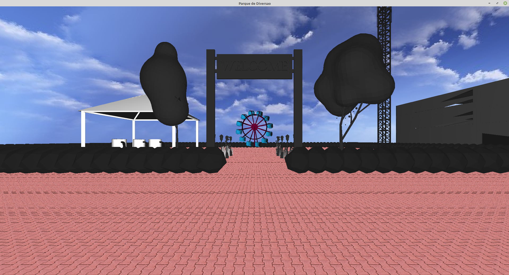

# Parque de Diversões - Ambiente LINUX

## Instalar bibliotecas do freeglut

```
sudo apt-get update
sudo apt-get install build-essential
sudo apt-get install mesa-common-dev
sudo apt-get install freeglut3
sudo apt-get install freeglut3-dev
sudo apt-get install libglew-dev
sudo apt-get install libglew1.5-dev libglm-dev
```

## Instalar biblioteca SOIL para suporte a textura 

```
sudo apt-get install libsoil-dev
```


## Instalar biblioteca SDL para suporte a músicas 

```
apt-get install libsdl1.2-dev libsdl-image1.2-dev libsdl-mixer1.2-dev libsdl-ttf2.0-dev 

```

## Compilar e executar

Para compilar e executar o projeto, execute de um terminal na pasta raiz:

```
make
```

## Instruções Gerais

Há 3  tipos de câmera controlado pelo teclado. A
    
    Tecla 1 - Camera diagonal do parque vista de cima, podendo ser controlado pelas teclas W,S,A,D
    Tecla 2 - Camera de cada brinquedo do parque podendo alternar entre cada brinquedo com as setas direita e esquerda do teclado
    Tecla 3 - Camera em primeira pessoa podendo move-la pelo parque pelas teclas W,S,A,D (Camera definida como padrão ao iniciar)

A neblina pode ser ativada ou desativada pela tecla N

## Screenshots




